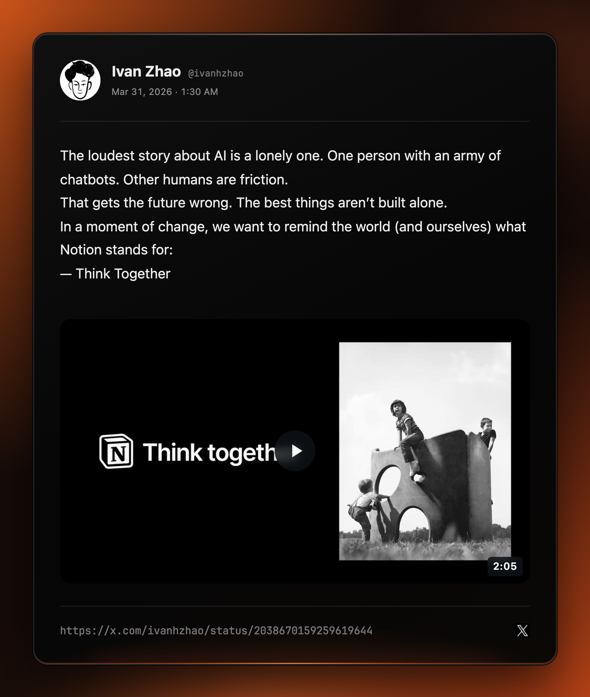
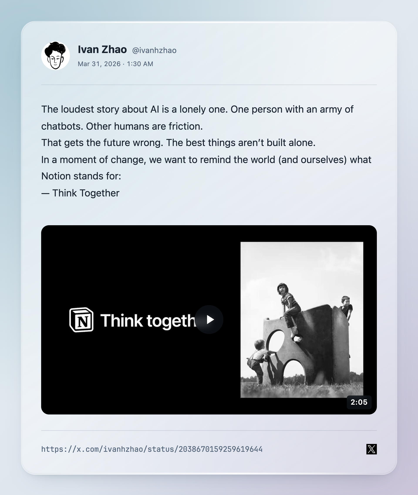
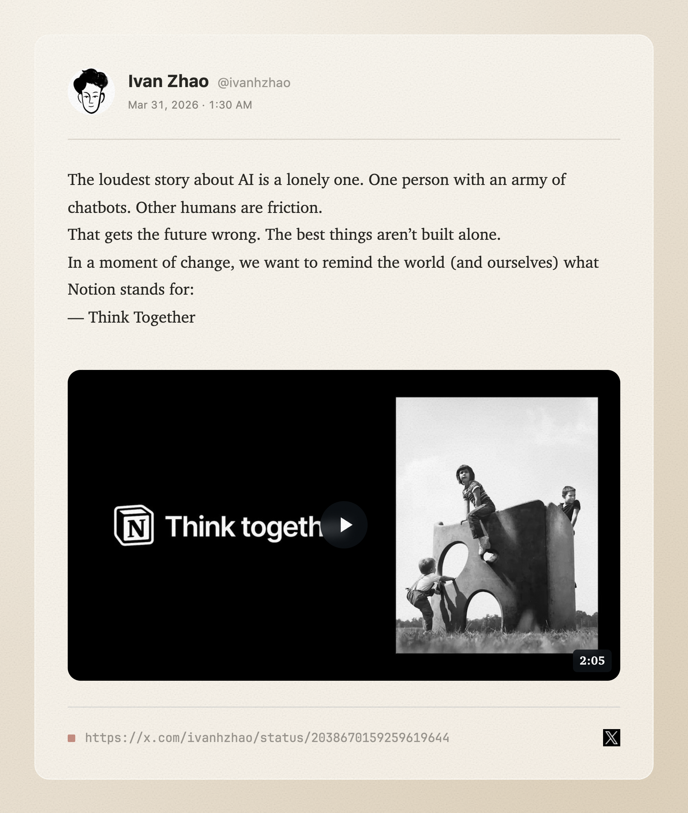

# QuickShare

把网页上值得分享的内容，变成一张好看的图片。

在 **X、知乎、ChatGPT、Gemini** 上可以分享整条内容；在公众号文章和其他网页上，选中文字就能分享。QuickShare 会保留文字、图片和原有排版，并提供三种卡片主题。打开预览后，图片会自动复制到剪贴板，也可以保存为 PNG。

  
  
  

*示例：[Ivan Zhao 的 X 帖子](https://x.com/ivanhzhao/status/2038670159259619644)。*

## 安装

从 [最新版本](https://github.com/hzCrafts/quick-share-extension/releases/latest) 下载 Chrome 安装包并解压，在 `chrome://extensions/` 开启开发者模式，选择「加载已解压的扩展程序」并指向解压后的文件夹。
